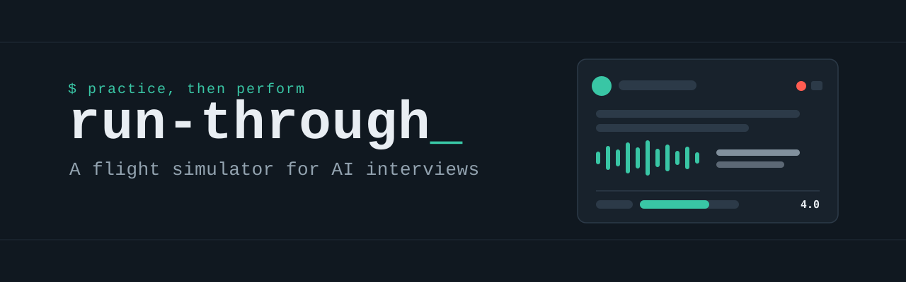
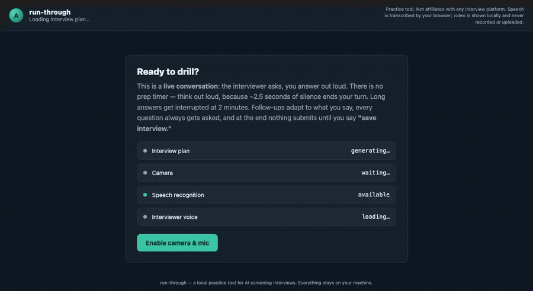

# run-through

**Open-source, local-first practice simulator for AI screening interviews. Your resume never leaves your machine.**

*A flight simulator for AI interviews — with an eval loop, so practice actually compounds.*

If you've started running into AI interviewers as gatekeepers — talking avatars that read your resume before the call, probe your responses one level deeper, and score the transcript — you've met a kind of interview that tests a performance skill nobody practices deliberately: thinking out loud under silence rules, defending your resume bullet by bullet and landing numbers on demand.

run-through is the practice rig I built when these screeners started showing up between me and interesting projects. It's an interviewer that reads your resume and dives on it, with an eval loop so you can tell whether practice is actually helping. This is aimed at the most common reasons people get tripped up, like going blank on claims mid-answer and losing the thread of a question halfway through.



*The interviewer quotes your resume back at you and dives a level deeper — then `evaluate.py` scores the transcript and the mastery tracker shows whether practice is compounding. (Demo uses the bundled fictional profile with the camera off; the session and every score shown, including the mastery trajectory, are illustrative demo data, not a real candidate's history.)*

## Practice only, by design

This tool is for **rehearsal before real interviews** — a place to burn off format shock and drill weak answers where mistakes are free.

Using AI assistance **during** a real interview or proctored assessment violates the terms of essentially every hiring platform and typically ends in an account ban. This project will not add live-assist features — no real-time answer feeds, no second-screen prompters — and pull requests adding them will be declined.

Your data stays yours: everything runs on `127.0.0.1`, transcripts are written to your disk, and your resume never leaves your machine except in calls to the LLM provider *you* configure (or nowhere at all in offline mode). Nothing is uploaded, logged, or phoned home.

## Why not a hosted app?

- **Privacy.** Your resume and transcripts stay on your disk. The only thing that ever sees them is the LLM provider *you* configure — or nothing at all in offline mode.
- **Cost.** Free. Bring your own API key, use a local CLI you already pay for, or run fully offline.
- **Control.** The question engine, the follow-up policy, and the scoring rubric are plain Python and HTML in front of you. When your target interview changes, change the tool.

## What it simulates — and why

The mechanics mirror publicly documented behavior of AI interviewers (see the [Zara system paper, arXiv:2507.02869](https://arxiv.org/abs/2507.02869), vendor guides like [micro1's](https://www.micro1.ai/ai-interview-guide), and candidate-facing prep write-ups such as [aitrainer.work](https://aitrainer.work/guides/zara-ai-interview-guide)):

- **Live conversation, no prep timer.** The interviewer speaks; you answer out loud. **~2.5 seconds of silence ends your turn** — the single most-reported surprise of real AI interviews. Ten seconds of initial silence earns a "take your time" nudge; two-minute answers get interrupted.
- **Resume-grounded questions.** With an LLM configured, the interview plan is generated from *your* resume — mains that quote your bullets back at you, each with a scripted two-deep dive-down chain (mechanism → numbers → what you left out).
- **Adaptive, bait-resistant follow-ups.** After each answer the interviewer paraphrases something specific you said, then alternates between going a level deeper on your most confident claim and probing an omission — so steering the interview toward your favorite topic doesn't work, just like the real thing.
- **Coverage enforcement.** Every main question always gets asked; when time runs short, follow-ups are dropped, not questions.
- **Proctoring pressure.** A camera self-view, a session clock, and a warning when you switch tabs — because real screeners flag it.
- **The end ritual.** Nothing submits until you say *"save interview"* out loud.

## The drill loop

```
  interview (voice, ~16 min)
        │  transcript → transcripts/
        ▼
  evaluate.py  — 7-dimension scored report → reports/
        │
        ▼
  mastery.md  — one line per session; watch weak areas move
        │
        ▼
  drill the fixes, re-run  ──────────────► back to the top
```

The evaluation grades the transcript the way the real systems do — content only, seven dimensions (depth, specificity, communication, completeness, follow-up survival, thinking aloud, time management) — and ends with the three highest-value fixes, each with a concrete drill.

## Quickstart

```bash
git clone <this repo> && cd <repo-dir>
python3 server.py          # zero config: bundled example resume, offline mode
open http://127.0.0.1:8488 # Chrome or Edge (speech recognition)
```

Then make it yours:

1. `cp config.yaml.example config.yaml` — pick a `provider` (`claude-cli`, `anthropic-api`, `openai-api`, or `none`) and set your target `role`.
2. Put your resume at `profile/resume.txt` (gitignored — it stays local).
3. Restart `server.py`. The interview plan is now generated from your resume; follow-ups adapt to what you actually say.
4. After a session: `python3 evaluate.py` for the scored report and tracker update.

No dependencies beyond Python 3.9+ (PyYAML optional). Voice needs Chrome or Edge; typing fallback works everywhere.

## Architecture

Three small pieces, all local:

- **`static/interview.html`** — the whole interview UI and turn-taking state machine: speech recognition, TTS, silence detection, nudges, interrupts, chains, crash-resume, transcript assembly.
- **`server.py`** — serves the page, generates the interview plan (`planner.py`), answers `/reply` with ack + follow-up per the anti-bait policy, stores transcripts. Providers are pluggable (`providers.py`); the LLM is one `complete(prompt) -> str` call away from swappable.
- **`evaluate.py`** — transcript in, scored markdown report out, one line appended to `mastery.md`.

Offline (`provider: none`) everything still works: a generic-but-solid question plan, canned follow-up probes, and a self-review worksheet instead of an LLM-scored report.

## FAQ

**Is this cheating?** No — it's rehearsal, the same as practicing with a friend. The line is *during*: never use AI help inside a real interview or assessment. See "Practice only, by design."

**Why voice instead of chat?** Because the thing these interviews actually test is spoken performance under time pressure. Typing practice doesn't transfer.

**Does it work without any LLM?** Yes — generic plan, canned probes, self-review worksheet. The adaptive resume-grounded experience needs a provider.

**Which browsers?** Chrome or Edge for voice (Web Speech API). Anything for typed mode.

## License

MIT.
